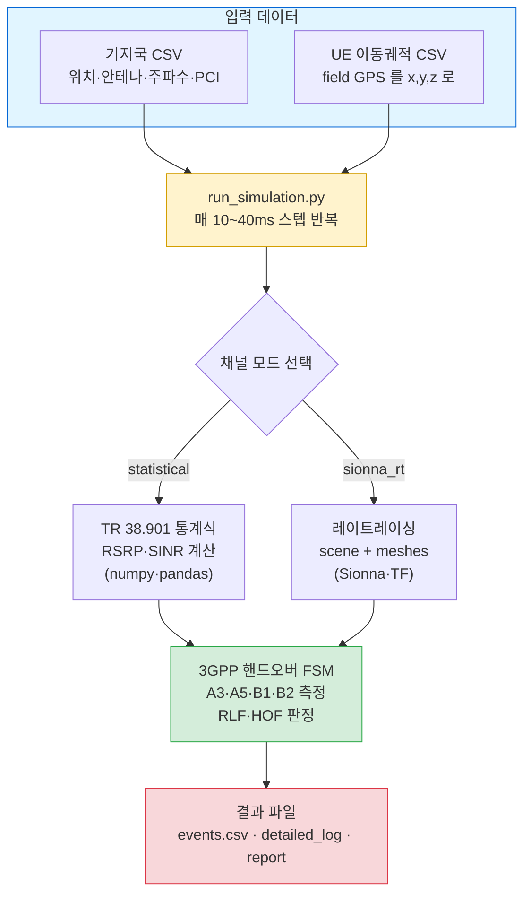

# KTX NR/LTE 핸드오버 시뮬레이터 (샘플)


> **한 줄 요약:** 고속열차(KTX)가 달리며 기지국을 갈아타는 과정(핸드오버)을,
> 실제 주행 GPS 궤적 위에서 3GPP 표준대로 재현하는 시뮬레이터입니다.

---

## 이게 뭔가요? (아주 쉽게)

휴대폰은 이동하면서 신호가 더 좋은 기지국으로 자동으로 연결을 옮깁니다. 이걸 **핸드오버(Handover, HO)** 라고 합니다.
시속 300km로 달리는 KTX 안에서는 이 교체가 매우 자주, 매우 빠르게 일어나서 가끔 실패(연결 끊김)도 생깁니다.

이 프로젝트는:
1. 실제 KTX 주행 중 기록한 GPS 위치와 기지국 정보를 입력받아,
2. 열차가 지나가는 매 순간 어느 기지국이 가장 좋은지 계산하고,
3. 3GPP 표준 규칙(A3/A5/B1/B2 등)으로 언제 핸드오버할지, 실패했는지를 판정합니다.

즉 **"디지털 트윈"** — 실제 망을 컴퓨터 안에서 똑같이 돌려보는 도구입니다.

---

## 전체 흐름



---

## 30초 빠른 시작

```bash
# 1) 최소 설치 (statistical 모드는 이 두 개면 끝)
pip install numpy pandas

# 2) 실행
python script/run_simulation.py --channel-model statistical \
  --gnb-csv enb_coordinates_converted_godeokhs_sample.csv \
  --ue-csv  ktx_ue_coordinates_godeokhs.csv \
  --ue-subset 0 --duration 60 --output-dir out

# 3) 결과 보기
ls out/            # events.csv · detailed_log_ue0.csv · simulation_report.txt
```

> [!TIP]
> `--ue-subset` 은 어느 열차(0~7)를 볼지, `--duration` 은 몇 초 돌릴지입니다.
> 처음이면 위 명령 그대로 실행해 보세요. TensorFlow·Sionna 설치 없이 바로 돕니다.

---

## 지원하는 핸드오버

핸드오버는 "측정 이벤트"라는 조건이 만족되면 일어납니다. 각 이벤트는 3GPP 표준(TS 38.331)에 정의돼 있습니다.

| 이벤트 | 쉬운 뜻 | 종류 |
|:---:|---|---|
| **A3** | "옆 기지국이 지금보다 훨씬 좋아졌다" | 같은 주파수 이동 (NR↔NR) |
| **A5** | "지금 기지국은 나빠졌고, 다른 주파수 기지국은 괜찮다" | 다른 주파수 이동 |
| **B1 / B2** | "다른 통신방식(LTE) 기지국이 충분히 좋다" | NR ↔ LTE 전환 |
| **A2** | "지금 기지국 신호가 나빠졌다" (트리거 보조) | — |

핸드오버가 실패하면 이렇게 분류합니다:

| 판정 | 뜻 |
|---|---|
| **RLF** (Radio Link Failure) | 신호가 끊겨 연결 실패 (T310/T311 타이머 기반) |
| **HOF Case 1~5** | 너무 늦음 / 너무 이름 / 잘못된 셀 / 핑퐁 / 실행 타이머 만료 (TS 38.300 §15.5) |

---

## 두 가지 데이터 세트 (섞지 마세요)

이 저장소에는 2개의 독립 세트가 있고, 각각 맞는 채널 모드가 정해져 있습니다.

### 세트 A — `statistical` (가볍고 권장)
```bash
pip install numpy pandas
python script/run_simulation.py --channel-model statistical \
  --gnb-csv enb_coordinates_converted_godeokhs_sample.csv \
  --ue-csv  ktx_ue_coordinates_godeokhs.csv \
  --ue-subset 0 --duration 60 --output-dir out
```
- 광명~천안아산(godeokhs) 구간 · UE 8편성 · 통계식 채널 · 설치 가벼움

### 세트 B — `sionna_rt` (레이트레이싱, 정밀)
```bash
pip install -r requirements.txt      # TensorFlow + Sionna 포함 (무거움)
python script/run_simulation.py --channel-model sionna_rt \
  --scene-path railway_scene.xml \
  --gnb-csv enb_coordinates_converted_goduck_sample.csv \
  --ue-csv  ktx_ue_coordinates.csv \
  --ue-subset 0 --duration 30 --output-dir out_rt
```
- goduck 구역 · scene(건물·지형) 정합 · 실제 전파 반사까지 계산

> [!WARNING]
> 세트를 교차하지 마세요. A 데이터(godeokhs)와 B의 scene은 좌표 원점이 달라 서로 어긋납니다.
> - godeokhs 데이터 → `statistical` (scene 불필요)
> - goduck 데이터 → `sionna_rt` + `railway_scene.xml` (좌표 일치)

---

## 결과 파일 읽는 법 (`out/`)

| 파일 | 내용 | 이런 걸 봐요 |
|---|---|---|
| **`events.csv`** | 사건 로그 | 핸드오버 시작/완료, RLF, 핑퐁이 언제 일어났나 |
| **`detailed_log_ue0.csv`** | 매 틱 상세 | 서빙 기지국(`serving_pci`), 신호세기(`serving_rsrp`/`sinr`/`rsrq`), 이웃 top1~3, FSM 상태 |
| **`simulation_report.txt`** | 요약 | 총 핸드오버 수, 성공/실패, RLF 수, HOF 분류 결과 |

예시 (`simulation_report.txt`):
```
Total Handovers: 12    Successful: 11    Failed: 1    RLF Count: 1
Case 1 - Too Late HO: 0   Case 4 - Ping-Pong: 2  ...
```

---

## 폴더 구조

```
.
├── README.md                                      # 이 문서
├── requirements.txt                               # 전체 재현용 (sionna_rt)
├── script/run_simulation.py                       # 실행 진입점
├── src/                                            # 시뮬레이터 코어 (numpy·pandas만 필요)
│   ├── channel/   (statistical / sionna_rt 채널)
│   ├── rrc/       (핸드오버 상태머신 · 측정)
│   ├── phy/       (SINR→BLER · RLF)
│   └── scenario/  (기지국·UE 로더)
│
├── enb_coordinates_converted_godeokhs_sample.csv  # [A] 기지국 100개
├── ktx_ue_coordinates_godeokhs.csv                # [A] UE 궤적 8편성 (10ms)
│
├── enb_coordinates_converted_goduck_sample.csv    # [B] 기지국 575개
├── ktx_ue_coordinates.csv                         # [B] UE 궤적 33개
├── railway_scene.xml · railway_scene_kc.xml       # [B] RT scene
└── meshes/                                         # [B] 건물·지형·선로 (.ply)
```

---

## 자주 묻는 질문

<details>
<summary><b>Q. TensorFlow/Sionna 설치 안 하고 쓸 수 있나요?</b></summary>

네. `statistical` 모드(세트 A)는 `numpy`·`pandas` 만 있으면 됩니다. Sionna가 없으면 자동으로 통계 모드로 동작합니다.
</details>

<details>
<summary><b>Q. sionna_rt가 "No SINR maps found" 라고 떠요.</b></summary>

경고일 뿐이며 정상 동작합니다. 사전계산 맵 없이 실시간 레이트레이싱으로 대체됩니다.
빠르게 하려면 `precompute_sinr_map.py`(원본 저장소)로 맵을 미리 구우면 됩니다.
</details>

<details>
<summary><b>Q. UE(열차)가 여러 개인데 하나만 보고 싶어요.</b></summary>

`--ue-subset 0` 처럼 번호를 주세요. 여러 개는 `--ue-subset 0,1,2`. 세트 A는 0~7, 세트 B는 0~32.
</details>

<details>
<summary><b>Q. 결과가 이상해요 / 핸드오버가 안 일어나요.</b></summary>

세트를 교차했는지 확인하세요(위 WARNING). 좌표 원점이 다르면 기지국과 열차가 서로 멀어져 신호가 잡히지 않습니다.
</details>

---

## 참고 & 데이터 메모

- **표준**: 3GPP TS 38.331 (측정·RRC) · TS 38.300 §15.5 (HOF 분류) · TS 38.133 (RLM) · TR 38.901 (채널 모델)
- **기지국 CSV (익명화)**: 실제 망 데이터를 공개용으로 처리 — gnb_id 재번호, 좌표 ±10m·안테나 파라미터 랜덤화,
  PCI는 기지국당 3자리 랜덤(같은 기지국=같은 PCI), `is_hsr_cell`(고속철도 셀) 유지.
  sionna_rt(세트 B)의 좌표는 ±10m 이동된 근사값입니다. 정밀 RT엔 실제 좌표가 필요합니다.
- **UE 궤적**: field GPS → scene-local `x,y,z`(m) 변환. godeokhs 세트는 10ms 격자 + GPS 노이즈 제거
  (실제 fix만 사용 → 이상치 게이트 → Savitzky-Golay 스무딩).

---

<sub>이 저장소는 샘플/데모용입니다. 실제 운영 파라미터·원본 좌표는 포함하지 않습니다.</sub>
