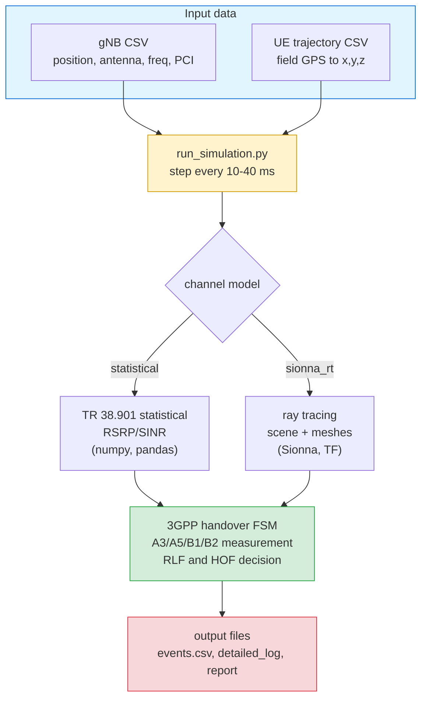

# KTX NR/LTE Handover Simulator (sample)


Replays recorded KTX high-speed-rail GPS trajectories against a 3GPP handover
state machine to reproduce handovers (HO), radio link failures (RLF), and
handover failures (HOF). Two channel models are included: a TR 38.901
statistical model (numpy/pandas only) and Sionna ray tracing.

## Overview

A phone moves its connection to a stronger cell as it travels; this is a
handover. On a train at 300 km/h it happens often and sometimes fails. The
simulator reads gNB data and the train's GPS track, computes the received
signal at each time step, and applies the 3GPP measurement rules (A3/A5/B1/B2)
to decide when a handover fires and whether it fails. Inputs are recorded
field measurements, so the channel is not modeled in the statistical case
beyond path loss; the point is the state machine, not the physics.

## Pipeline



## Install and run

The statistical mode needs only numpy and pandas. No TensorFlow or Sionna.

```bash
pip install numpy pandas

python script/run_simulation.py --channel-model statistical \
  --gnb-csv enb_coordinates_converted_godeokhs_sample.csv \
  --ue-csv  ktx_ue_coordinates_godeokhs.csv \
  --ue-subset 0 --duration 60 --output-dir out

ls out/   # events.csv, detailed_log_ue0.csv, simulation_report.txt
```

`--ue-subset` selects which train (0-7); `--duration` is the number of seconds
to run (omit for the full trajectory).

## Supported handovers

Handovers are triggered by measurement events defined in 3GPP TS 38.331.

| Event | Meaning | Type |
|:---:|---|---|
| A3 | A neighbor becomes offset+hysteresis better than the serving cell | Intra-frequency (NR to NR) |
| A5 | Serving drops below one threshold while an inter-frequency neighbor is above another | Inter-frequency |
| B1 / B2 | A cell on another RAT (LTE) is strong enough | Inter-RAT (NR to LTE) |
| A2 | Serving quality has degraded (auxiliary trigger) | — |

Failures are classified as:

| Verdict | Meaning |
|---|---|
| RLF (Radio Link Failure) | Link lost via the N310/T310/T311 timers |
| HOF Case 1-5 | Too late / too early / wrong cell / ping-pong / T304 expiry (TS 38.300 section 15.5) |

## Datasets (do not mix)

The repository ships two independent sets. Each pairs with one channel mode
because they use different coordinate origins.

### Set A: statistical (recommended, lightweight)

```bash
pip install numpy pandas
python script/run_simulation.py --channel-model statistical \
  --gnb-csv enb_coordinates_converted_godeokhs_sample.csv \
  --ue-csv  ktx_ue_coordinates_godeokhs.csv \
  --ue-subset 0 --duration 60 --output-dir out
```

Gwangmyeong to Cheonan-Asan (godeokhs) corridor, 8 trains, statistical channel.

### Set B: sionna_rt (ray tracing)

```bash
pip install -r requirements.txt          # includes TensorFlow and Sionna
python script/run_simulation.py --channel-model sionna_rt \
  --scene-path railway_scene.xml \
  --gnb-csv enb_coordinates_converted_goduck_sample.csv \
  --ue-csv  ktx_ue_coordinates.csv \
  --ue-subset 0 --duration 30 --output-dir out_rt
```

Goduck area, aligned with the scene geometry (buildings and terrain).

> [!WARNING]
> Do not cross the sets. The godeokhs data and the scene use different origins,
> so they do not line up geographically.
> - godeokhs data goes with `statistical` (no scene).
> - goduck data goes with `sionna_rt` and `railway_scene.xml`.

## Output files (`out/`)

| File | Contents |
|---|---|
| `events.csv` | When each handover start/complete, RLF, and ping-pong occurred |
| `detailed_log_ue0.csv` | Per-tick serving cell (`serving_pci`), signal (`serving_rsrp`/`sinr`/`rsrq`), top 1-3 neighbors, FSM state |
| `simulation_report.txt` | Totals: handover count, success/fail, RLF count, HOF breakdown |

Example (`simulation_report.txt`):

```
Total Handovers: 12    Successful: 11    Failed: 1    RLF Count: 1
Case 1 - Too Late HO: 0   Case 4 - Ping-Pong: 2  ...
```

## Repository layout

```
.
├── README.md
├── requirements.txt                               # full deps (sionna_rt)
├── script/run_simulation.py                       # entry point
├── src/                                            # core (needs only numpy, pandas)
│   ├── channel/   statistical / sionna_rt models
│   ├── rrc/       handover state machine, measurement
│   ├── phy/       SINR to BLER, RLF
│   └── scenario/  gNB and UE loaders
│
├── enb_coordinates_converted_godeokhs_sample.csv  # [A] 100 gNBs
├── ktx_ue_coordinates_godeokhs.csv                # [A] 8 trains, 10 ms
│
├── enb_coordinates_converted_goduck_sample.csv    # [B] 575 gNBs
├── ktx_ue_coordinates.csv                         # [B] 33 UEs
├── railway_scene.xml, railway_scene_kc.xml        # [B] RT scene
└── meshes/                                         # [B] buildings, terrain, track (.ply)
```

## References and data notes

- Standards: 3GPP TS 38.331 (measurement, RRC), TS 38.300 section 15.5 (HOF
  classification), TS 38.133 (RLM), TR 38.901 (channel model).
- gNB CSVs are anonymized for release: gNB ids renumbered, positions jittered
  by about 10 m, antenna parameters randomized, PCI assigned per gNB from a
  three-digit pool (same gNB keeps one PCI), `is_hsr_cell` preserved. The Set B
  (sionna_rt) positions are therefore approximate; precise ray tracing needs
  the true coordinates.
- UE trajectories are field GPS converted to scene-local `x,y,z` in meters. The
  godeokhs set is on a 10 ms grid with GPS noise removed (real fixes only, then
  an outlier gate, then Savitzky-Golay smoothing).

This repository is a sample for demonstration. It does not contain real
operational parameters or original coordinates.
